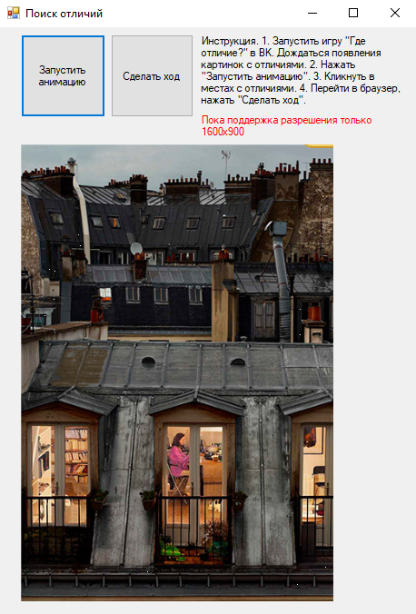

# DifferencesFinder
Программа облегчения поиска отличий между двумя картинками для быстрого прохождения <a href="https://vk.com/app6117747" target="_blank">игры из ВК</a> "Где отличие?". Делает скриншоты двух рядом расположенных картинок в браузерной игре и создает анимацию их быстрой смены, что позволяет быстро найти отличия. Запоминает координаты щелчков мышью по изображению и может повтроить клики в соотвествующих местах на экране.
 
