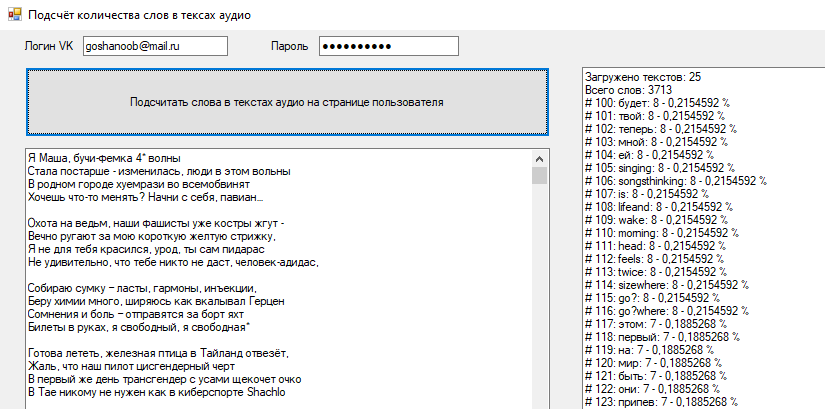

# MatchesCounter
Программа для подсчета количетсва повторений слов в текстах песен из ВК. Программа подгружает тексты песен из музыкального профиля указанного пользователя и считает повторяющиеся слова. Используется бибилиотека <a href="https://vknet.github.io/vk/" target="_blank">VkNet</a> для упрощения работы с VK API. <a href="https://yandex.ru/company/researches/2018/rap" target="_blank">Вдохновлено исследованием Яндекса.</a>
 
