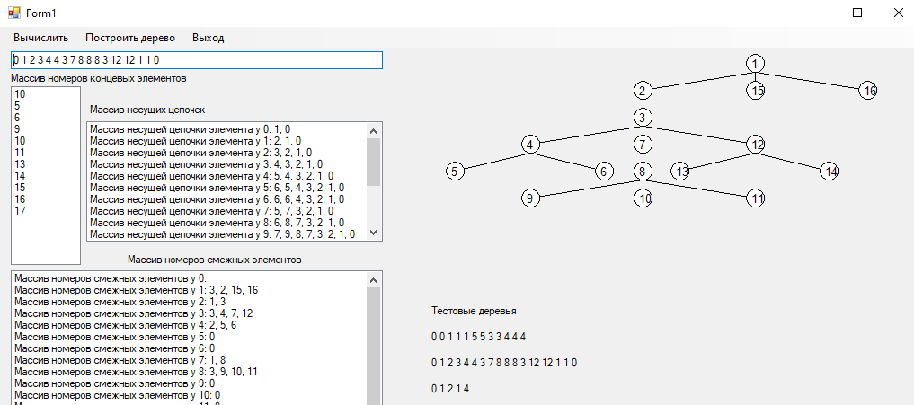

# TreeSystem
В классе TreeSystem реализованы методы вычисления концевых, смежных элементов, 
несущих цепочек для древовидной системы. Объект имеет свойства: 
Bases – массив номеров базовых элементов (Bases[i] - номер базового элемента для элемента с номером i); 
Ends – список концевых элементов (первый элемент списка Ends[0] содержит количество 
найденных концевых элементов); 
Adjac – список списков номеров смежных элементов системы;  
Adjac [i][j] – элемент с номером j, смежный i-му; 
Adjac [i][0] – количество элементов, смежных i-му; 
Supp – список списков номеров несущих элементов (заполняется), 
Supp [i][j] – элемент с номером j, входящий в несущую цепочку i-го элемента; 
Supp [i][0] – количество элементов, входящих в несущую цепочку i-го элемента.
 
